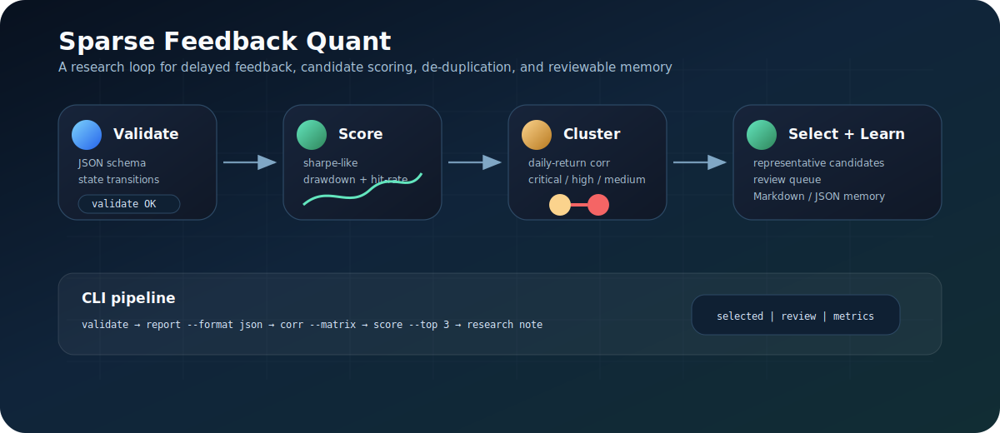
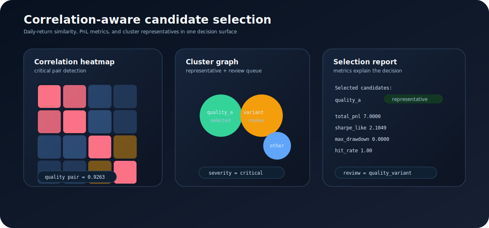

# 🧪 Sparse Feedback Quant

一个面向自动化研究系统的轻量级 Python 工具包，用于组织稀疏反馈实验、描述量化因子候选、检查策略冗余，并生成可复核的研究笔记。

A lightweight Python toolkit for automated research systems. It organizes sparse-feedback experiments, describes quantitative factor candidates, checks strategy redundancy, and generates reviewable research notes.



## ✨ 项目概览 / Overview

在真实研究环境中，实验反馈往往是延迟、嘈杂、部分可见或只有通过/失败信号的。Sparse Feedback Quant 将这些约束建模为明确的工程对象：实验状态、候选元数据、日收益相关性和研究记忆。

In real research environments, feedback is often delayed, noisy, partially visible, or reduced to pass/fail signals. Sparse Feedback Quant models these constraints as explicit engineering objects: experiment state, candidate metadata, daily-return correlation, and research memory.

该项目适合用于构建 agentic research loop、量化研究流水线、策略候选去重工具、实验复盘系统和开放评测任务。

The project is designed for agentic research loops, quantitative research pipelines, strategy de-duplication tools, experiment review systems, and open evaluation tasks.

## 🚀 核心能力 / Core Capabilities

| 能力 / Capability | 作用 / What it does | 输出 / Output |
| --- | --- | --- |
| 🧭 稀疏反馈实验 / Sparse-feedback experiments | 组织 `proposed`、`running`、`partial`、`accepted`、`rejected`、`needs_review` 等状态 | 实验状态分布 / state distribution |
| 🧬 因子候选元数据 / Factor candidate metadata | 用经济逻辑族、数据频率、预期换手、反馈来源和风险备注描述候选 | 可比较的候选记录 / comparable candidate records |
| 🔗 日收益相关性检测 / Daily-return correlation checks | 将累计 PnL 转换为日收益变化，再计算相关性 | pairs、clusters、matrix |
| 📈 PnL 指标评分 / PnL scoring | 计算 total PnL、Sharpe-like、max drawdown、hit rate | candidate metrics |
| 🎯 候选选择 / Candidate selection | 在高相关簇中保留代表候选，并生成 review queue | selected、review、reasons |
| 📝 研究记忆生成 / Research memory generation | 将实验记录整理为 Markdown 或 JSON 总结 | reviewable research note |

### 🧭 稀疏反馈实验 / Sparse-feedback experiments

  以 `proposed`、`running`、`partial`、`accepted`、`rejected`、`needs_review` 等状态组织实验生命周期。  
  Track experiment lifecycles with states such as `proposed`, `running`, `partial`, `accepted`, `rejected`, and `needs_review`.

### 🧬 因子候选元数据 / Factor candidate metadata

  用经济逻辑族、数据频率、预期换手、反馈来源和风险备注描述候选，便于跨实验比较和筛选。  
  Describe candidates by economic family, data cadence, expected turnover, feedback channel, and risk notes for comparison and filtering.

### 🔗 日收益相关性检测 / Daily-return correlation checks

  将累计 PnL 转换为日收益变化，再计算相关性，帮助识别重复或高度相似的候选。  
  Convert cumulative PnL into daily deltas before computing correlation, helping identify duplicated or highly similar candidates.

### 📈 PnL 指标评分与候选选择 / PnL scoring and candidate selection

  从累计 PnL 中计算收益、波动、Sharpe-like、最大回撤、胜率，并结合相关性簇选择代表候选。  
  Compute return, volatility, Sharpe-like score, maximum drawdown, and hit rate, then combine them with correlation clusters to select representative candidates.

### 📝 研究记忆生成 / Research memory generation

  将实验记录整理为 Markdown 笔记，沉淀失败类型、候选家族分布、平均分数和后续复核线索。  
  Turn experiment records into Markdown notes that summarize failure taxonomy, candidate-family distribution, average score, and review cues.

## 🖼️ 图片讲解 / Visual Explanation



上图展示了相关性分析如何从累计 PnL 进入可执行决策：高相关候选会被归入同一个 cluster，工具给出代表候选和待复核候选。

The diagram shows how cumulative PnL becomes an actionable review decision: highly correlated candidates are grouped into a cluster, with a representative candidate and review candidates.

## ⚡ 安装与运行 / Installation And Usage

```bash
python -m pip install -e .
python -m sparse_feedback_quant validate examples/synthetic_experiments.json
python -m sparse_feedback_quant report examples/synthetic_experiments.json
python -m sparse_feedback_quant report examples/synthetic_experiments.json --format json
python -m sparse_feedback_quant corr examples/synthetic_pnl.csv --matrix
python -m sparse_feedback_quant corr examples/synthetic_pnl.csv --format json
python -m sparse_feedback_quant score examples/synthetic_pnl.csv --top 3
python -m sparse_feedback_quant score examples/synthetic_pnl.csv --format json
```

这些命令覆盖实验文件校验、Markdown 研究总结、JSON 汇总、相关性矩阵、候选评分和机器可读报告。

These commands cover experiment-file validation, Markdown research summaries, JSON summaries, correlation matrices, candidate scoring, and machine-readable reports.

### 📌 示例输出 / Example output

```text
High-correlation pairs:
quality_a,quality_variant,0.9263,critical

Clusters:
representative=quality_a; review=quality_variant; members=quality_a,quality_variant
```

```text
Selected candidates:
quality_variant,score=4.8821,total_pnl=6.8000,sharpe_like=4.8821,max_drawdown=0.0000,hit_rate=1.00

Review candidates:
quality_a,highly correlated with representative quality_variant
```

这个结果表示 `quality_a` 与 `quality_variant` 在日收益层面高度相似，适合进入去重、复核或重新设计流程。

This result indicates that `quality_a` and `quality_variant` are highly similar at the daily-return level and should enter a de-duplication, review, or redesign flow.

## 🧩 Python API

```python
from sparse_feedback_quant.correlation import analyze_correlations, report_to_dict
from sparse_feedback_quant.experiment import Experiment, SparseFeedbackState
from sparse_feedback_quant.memory import build_research_note
from sparse_feedback_quant.selection import select_candidates, selection_to_dict

experiments = [
    Experiment("exp-001", "quality", SparseFeedbackState.ACCEPTED, score=1.12),
    Experiment("exp-002", "momentum", SparseFeedbackState.REJECTED, score=0.42, failure_reason="turnover"),
]

note = build_research_note(experiments)
print(note)

report = analyze_correlations(
    {
        "candidate_a": [0.0, 1.0, 1.6, 2.2],
        "candidate_b": [0.0, 0.9, 1.5, 2.0],
    },
    threshold=0.7,
)
print(report_to_dict(report))

selection = select_candidates(
    {
        "candidate_a": [0.0, 1.0, 1.6, 2.2],
        "candidate_b": [0.0, 0.9, 1.5, 2.0],
    },
    threshold=0.7,
)
print(selection_to_dict(selection))
```

## 🗂️ 目录结构 / Repository Layout

```text
sparse-feedback-quant/
  pyproject.toml
  README.md
  LICENSE
  PRIVACY.md
  docs/
    assets/
      workflow.svg
      correlation-cluster.svg
    architecture.md
    model_lessons.md
    challenge_spec.md
  examples/
    synthetic_experiments.json
    synthetic_pnl.csv
  src/
    sparse_feedback_quant/
      __init__.py
      __main__.py
      cli.py
      correlation.py
      experiment.py
      factor.py
      metrics.py
      selection.py
      memory.py
  tests/
    test_correlation.py
    test_memory.py
```

## 🏁 开放挑战 / Open Challenge

**稀疏反馈自动化与量化因子挖掘**  
**Sparse Feedback Automation Meets Quantitative Factor Mining**

挑战任务是构建一个自动化研究循环：提出候选、接收稀疏反馈、更新实验状态、检查候选多样性，并输出可复核的研究笔记。

The challenge is to build an automated research loop that proposes candidates, receives sparse feedback, updates experiment state, checks candidate diversity, and emits reviewable research notes.

评测维度 / Evaluation dimensions:

- 反馈效率 / feedback efficiency
- 候选多样性 / candidate diversity
- 部分反馈处理能力 / partial-feedback handling
- 研究笔记质量 / research-note quality
- 可复现实验流程 / reproducible workflow design

## 📚 文档 / Documentation

- [Architecture](docs/architecture.md)
- [Model Lessons](docs/model_lessons.md)
- [Challenge Spec](docs/challenge_spec.md)
- [Privacy Notes](PRIVACY.md)

## 📄 许可证 / License

MIT. See [LICENSE](LICENSE).
